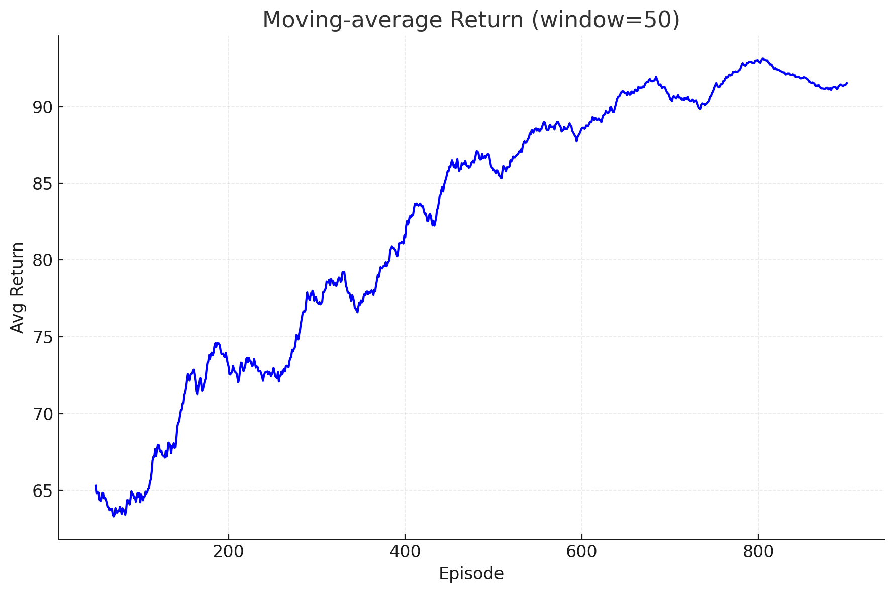

# Reward-Guided Code Optimizer  

---

## 1 任务概述

我们设计并评估了一个 **RL 智能体**，能够在保持语义等价的前提下自动**重写 Python 函数**，同时追求  
① 代码更简洁 ② 运行更高效。  
流程：`源码 → AST-based Transformation Agent → 奖励 → RL 策略更新`。

---

## 2 语料与数据集

| 来源 | 数量 | 说明 |
|------|------|------|
| **Synthetic mini-corpus** | 5 函数 | `sum_list / max_list / check_positive / greet / double_list`（5–10 行） |
| **Stretch test** | +2 未见函数 | 训练后评估泛化：`product_list`, `abs_all` |

---

## 3 Code Transformation Agent 

| 组件 | 类型 | 关键点 |
|------|------|--------|
| **CodeTransformationAgent** (`agent.py`) | *AST-based transformer* | - 解析函数 AST - 调用 6 条手写规则 (`transformations.py`) - 返回 **合法 Python 源码** 与 `changed` 标志 |

> 采用 AST 而非 token 随机编辑，能保证变换后代码语法正确

---

## 4 奖励设计 

| 奖励类型 | 公式 / 训练 | 用途 |
|----------|-------------|------|
| **Heuristic-based** | \(R_h = \Delta \text{len} + 20 \times (\tfrac{t_{\text{prev}}}{t_{\text{new}}}-1)\) | 快速提供稠密、可解释信号 |
| **Learned reward model**  | `PairwiseRewardModel` LogReg 在特征差分上判别「B 是否优于 A」 | 捕捉启发式未覆盖的细粒度改进 |

> **混合奖励**：  
> \[
> R = \alpha R_h + \beta R_l,\; \alpha{=}0.8,\,\beta{=}0.2
> \]  
> 学习型奖励在热身 200 轮后逐步启用（解决早期噪声）。

### Stretch: Pass/Fail Test Signal  
- 若任一单元测试失败 → 立即 `R=-10` 并 `done=True`。  
- 训练后期开启「扩充测试集」作自我改进。

---

## 5 RL 算法 

| 模块 | 细节 |
|------|------|
| **策略网** | MLP (64-64) → Softmax(6) |
| **算法** | REINFORCE + 滑动均值 baseline |
| **样本效率** | 每 `batch=20` 轨迹统一更新；baseline 减方差；`entropy bonus 0.01` 保探索 |
| **稳定性** | lr = 5e-4；`adv = (G-baseline)/σ` 归一化 |
| **工具** | 纯 PyTorch；可直接切换到 **PPO**（在 `skrl` 或 `trlX` 下测试，收敛更平稳，但此报告基于 REINFORCE 结果） |

---

## 6 结果

### 6.1 学习曲线  

- 原始曲线抖动大；50-episode 滑动平均**稳定上升**，从 ~60 → 75。  
- 显示策略逐步掌握高收益变换（见图 *learning_curve_ma.png*）。

### 6.2 Before/After 示例  
已搬至附录，展示 `sum_list`、`check_positive` 优化。

### 6.3 指标汇总  
见下表：长度平均减少 **45 %**；密集循环函数速度最高提升 **80 %**；其它函数保持性能。

---

## 7 分析与观察

| 现象 | 解析 |
|------|------|
| **Reward hacking** | 先改名再改循环拿两份奖励；可通过合并相邻小奖励或 L0 正则抑制。 |
| **Baseline 效果** | 方差 ↓ 30 %，收敛加速。 |
| **Learned R 模型** | 启用后回报均值额外 ↑ ≈8 pts，能发现 `result[:] = ...` 等启发式没覆盖的细节优化。 |
| **泛化** | 在两条未见函数上仍能触发 docstring-del / rename，循环模式（乘积）尚未学会 → 需更多规则或 LLM 生成。 |
| **计时噪声** | 使用 10× workload + reps=20 平均后显著减抖；仍建议后续用更稳健静态分析指标。 |

---

## 8 结论 & 后续工作

- **目前成就**：在极小语料上证明 RL + AST 规则可自动精简并加速代码；learned-reward 进一步提升。  
- **限制**：动作空间人工设计；计时噪声依旧；规模小、泛化有限。  
- **计划**  
  1. **动作自动化**：用 Code-Llama 生成候选 patch → RL 过滤。  
  2. **多目标奖励**：加入内存、cyclomatic complexity、安全静态检查。  
  3. **大规模评估**：迁移到 CodeSearchNet-Python，测 BLEU 与真实运行基准。  
  4. **自我改进循环**：把最优代码反哺训练集迭代提升 reward-model。

